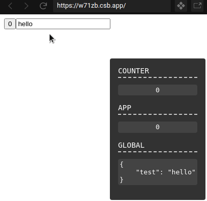

# Solid Debug

Simple visual debugger for [solid](https://github.com/ryansolid/solid)



[Demo](https://codesandbox.io/s/solid-debugger-w71zb)

## Quick start

Install it:

```bash
pnpm add @amoutonbrady/solid-debug
```

Use it:

```tsx
import { render } from 'solid-js/dom';
import { Component, createSignal, createState } from 'solid-js';
import { DebugProvider, useDebugger } from '@amoutonbrady/solid-debug';

const App: Component = () => {
  const [count, setCount] = createSignal(0);
  const [s, ss] = createState({ test: 'hello' });

  // Register a context (if empty, it will be added to the global context)
  const debugGlobal = useDebugger();
  const debugApp = useDebugger('app');
  const debugCounter = useDebugger('counter');

  debugCounter(count);
  debugGlobal(count);
  debugApp(s);

  return (
    <>
      <button onClick={() => setCount(count() + 1)}>{count()}</button>
      <input value={s.test} onInput={(e) => ss({ test: e.target.value })} />
    </>
  );
};

const root = document.getElementById('app');

if (root) {
  render(
    () => (
      // Wrap the app with the provider
      <DebugProvider>
        <App />
      </DebugProvider>
    ),
    root,
  );
}
```
